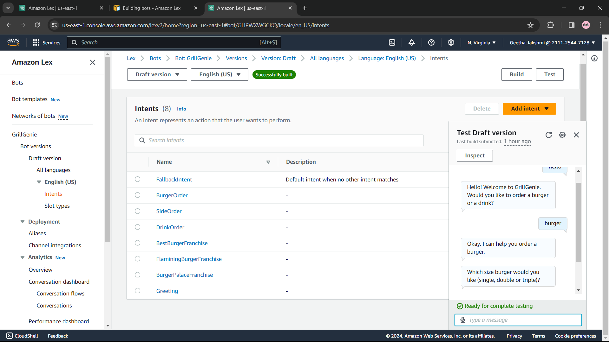
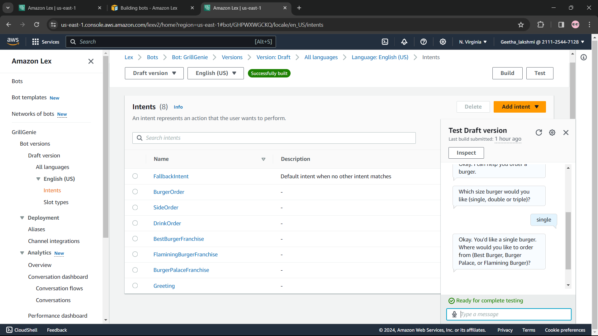
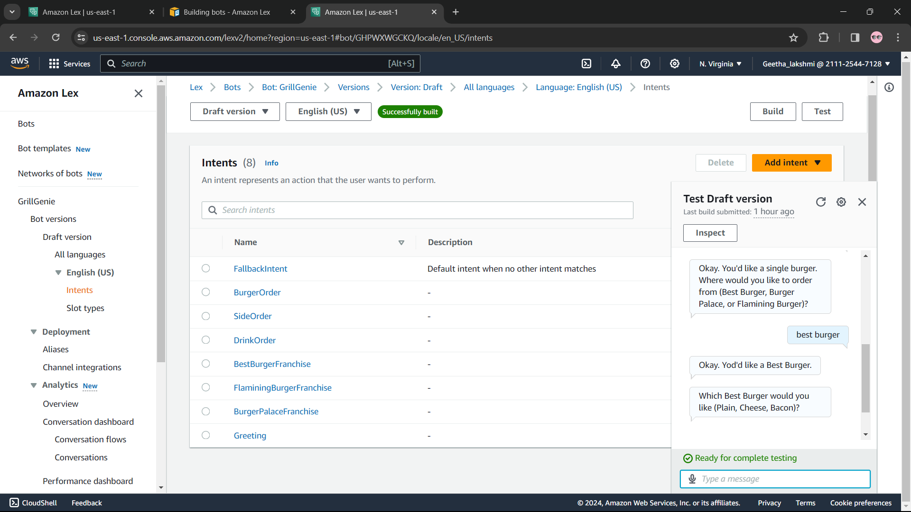
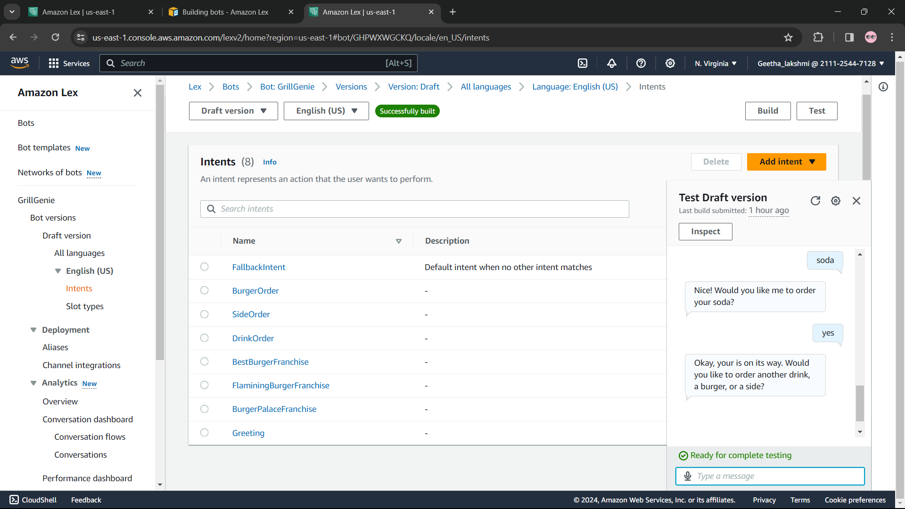
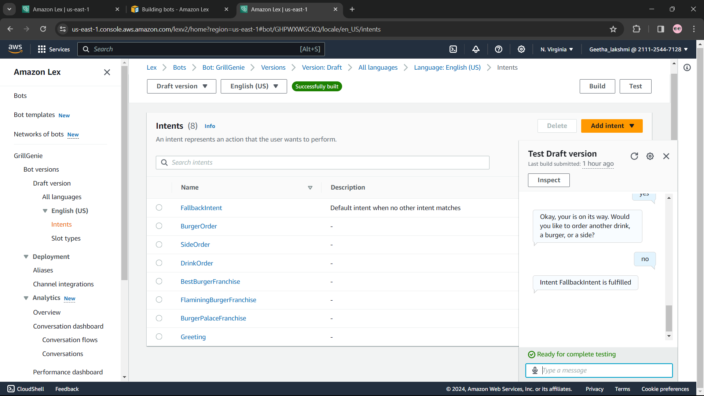

# Amazon Lex Chatbot Project

**Conversational AI Chatbot built using Amazon Lex**

## 📋 Project Overview
Built a functional chatbot using **Amazon Lex** — AWS’s fully managed conversational AI service. The bot demonstrates natural language understanding, intent recognition, and multi-turn conversations.

## ✨ Features
- Intent and Utterance configuration
- Slot filling for collecting user details
- Multi-turn dialog management
- Greeting and confirmation responses

## 🛠️ Technology Used
- **Amazon Lex** (Primary service)

## 📸 Screenshots

## 📄 Full Project Report
[📥 Download Project Document](Project%Report.docx)

## Key Learnings
- Designed conversation flows and user interactions
- Configured Intents, Slots, and Utterances
- Gained practical experience with AWS Conversational AI

---

**Part of my Cloud & AI Portfolio**
